# AI Threat Hunt Agent in Microsoft Foundry

## Overview

The **AI Threat Hunt Agent** is an AI-powered cybersecurity assistant built in **Microsoft Foundry** to support Security Operations Center (SOC) teams with alert investigation, threat hunting, detection engineering, IOC analysis, and security reporting.

The agent helps analysts review suspicious activity, organize evidence, generate investigation steps, map activity to MITRE ATT&CK, create KQL hunting queries, and produce structured shift handoff summaries.

This project demonstrates how AI can support cybersecurity teams by making investigations faster, more consistent, and easier to document while keeping human analysts responsible for final decisions.

### Non-Technical Explanation

This project is like a trained security assistant that helps analysts review clues from security tools.

For example, if a user reports suspicious PowerShell activity, the agent can review alert details, device information, process activity, command-line activity, and known attacker behavior to help explain what may be happening.

In simple terms, the agent does not replace the analyst. It helps organize the evidence so the analyst can make a better decision.

---

## Key Capabilities

- IOC analysis and validation
- Security incident investigation
- Malware analysis support
- Threat hunting support
- MITRE ATT&CK mapping
- Detection engineering review
- False positive analysis
- KQL query generation
- Shift handoff reporting
- Investigation summary creation
- Analyst decision support

### Non-Technical Explanation

The agent helps with the repeated work analysts do every day, such as checking suspicious files, reviewing alerts, looking for patterns, and writing clear investigation notes.

---

## Business Problem

Security analysts often spend a lot of time collecting information from multiple tools, reviewing alerts, validating suspicious indicators, writing queries, and documenting results.

This can slow down investigations, especially when alerts are noisy, incomplete, or spread across different systems.

This project demonstrates how an AI assistant can help with repeatable investigation tasks while still following a careful, evidence-based process.

### Non-Technical Explanation

Security teams receive many alerts. Some are serious, some are harmless, and some need more review.

The problem is that analysts must spend time sorting through all of this information before they can decide what matters.

This agent helps organize the information faster so analysts can focus on the final decision.

---

## Solution

The **AI Threat Hunt Agent** combines investigation instructions, uploaded security knowledge, and analyst-provided evidence to generate structured investigation outputs.

The solution uses:

- Microsoft Sentinel security alerts and logs
- Microsoft Defender XDR investigation data
- Endpoint and device information
- Threat intelligence sources
- MITRE ATT&CK behavior mapping
- SOC investigation procedures
- Detection engineering guidance
- KQL query examples
- Validation prompts and test scenarios

In simple terms, the agent takes security information, compares it against trusted knowledge, and helps produce investigation-ready results.

### Non-Technical Explanation

The agent works like a checklist-driven assistant.

It reviews the details provided, checks them against known security knowledge, and returns a clear summary that an analyst can review.

---

## What the Agent Reviews Before Helping an Analyst

The agent reviews the information provided in the investigation prompt before producing an answer.

This may include:

- Alert details
- Device or host information
- User account information
- Process activity
- Command-line activity
- Parent process information
- Domain, IP address, URL, or file hash indicators
- Threat intelligence context
- Known attacker behavior
- MITRE ATT&CK techniques
- Relevant knowledge base material

### Non-Technical Explanation

This is the information the agent reviews before helping an analyst.

For example, if a user reports suspicious PowerShell activity, the agent can use alert details, device information, process activity, and known threat behavior to help explain what may be happening.

In simple terms, the agent looks at the available clues first, then helps organize those clues into a clear investigation summary.

---

## Step-by-Step Project Workflow

### Step 1: Create the AI Agent

The project starts by creating a new AI agent in Microsoft Foundry.

Agent name:

```text
threat-hunt-agent
```

Purpose:

- Create the AI assistant.
- Prepare the agent for SOC investigation tasks.
- Establish the main workspace for testing and validation.

### Non-Technical Explanation

This step is like creating a new digital team member and giving it a security analyst role.

---

### Step 2: Add SOC Analyst Instructions

The agent is configured with instructions that explain how it should investigate and respond.

The instructions tell the agent how to:

- Review evidence first
- Avoid unsupported claims
- Investigate IOCs
- Analyze malware indicators
- Map activity to MITRE ATT&CK
- Generate KQL queries
- Recommend escalation steps
- Create shift handoff summaries
- Clearly separate confirmed evidence from assumptions

### Non-Technical Explanation

This step gives the agent a job description, rules, and a checklist so it responds in a consistent way.

---

### Step 3: Upload Knowledge Sources

The agent is connected to uploaded cybersecurity knowledge sources.

These sources include:

- Threat hunting procedures
- Malware analysis notes
- Detection engineering guidance
- Microsoft Sentinel content
- Microsoft Defender XDR guidance
- MITRE ATT&CK references
- KQL examples
- Incident response references

### Non-Technical Explanation

This gives the agent a trusted reference library so it can use approved project knowledge instead of guessing.

---

### Step 4: Build the Knowledge Base

A knowledge base is created to help the agent search and use the uploaded documents.

Knowledge base name:

```text
threat-hunt-kb
```

Knowledge base purpose:

- Store cybersecurity reference material
- Support investigation responses
- Improve consistency
- Reduce unsupported answers
- Help the agent follow approved procedures

### Non-Technical Explanation

The knowledge base works like a digital library that the agent can search while helping with investigations.

---

### Step 5: Test the Agent

The agent is tested using realistic SOC scenarios.

Testing covers:

- IOC investigations
- Microsoft Sentinel incidents
- Threat hunting prompts
- Detection engineering prompts
- False positive review

### Non-Technical Explanation

This step checks whether the agent can handle the types of tasks a real security analyst may face.

---

### Step 6: Validate the Results

The test results are recorded in the validation matrix.

The validation matrix checks:

- Whether the answer was accurate
- Whether the answer followed the correct structure
- Whether the agent avoided unsupported claims
- Whether the KQL was useful
- Whether the final recommendation was reasonable
- Whether the response was clear enough for SOC reporting

### Non-Technical Explanation

The validation matrix works like a report card for the AI agent.

It shows whether the agent passed the tests and produced useful results.

---

### Step 7: Document the Project

The project is documented in GitHub using Markdown files.

Documentation includes:

- `README.md`
- `architecture.md`
- `validation-matrix.md`
- `deployment-guide.md`
- `lessons-learned.md`
- `security-controls.md`

### Non-Technical Explanation

Documentation makes the project easier to understand, review, and present as a portfolio project.

---

## Architecture

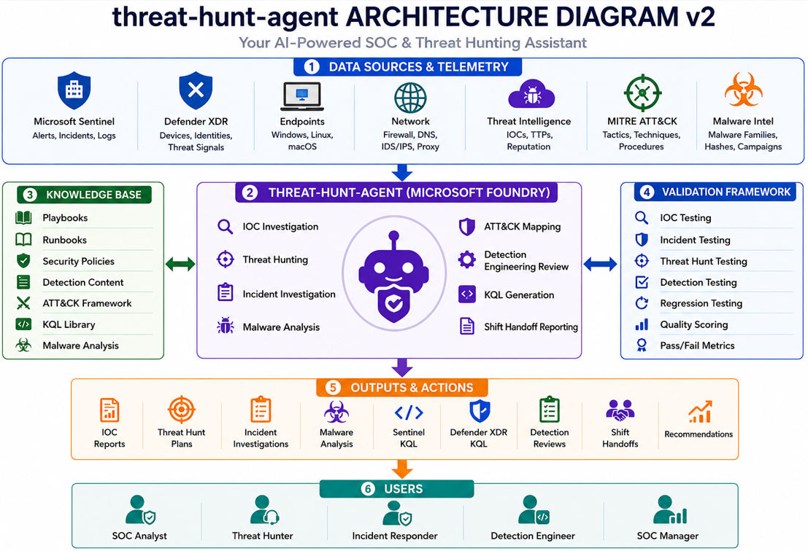

## Architecture Summary

The architecture shows how security data, threat intelligence, uploaded knowledge, Microsoft Foundry, and validation testing work together to support SOC investigations.

In simple terms, the agent takes security information, checks it against a knowledge base, creates an investigation response, and produces useful outputs for analysts.

### Non-Technical Explanation

The architecture shows the flow of information.

Security data goes in, the agent reviews it, the knowledge base supports the answer, and the analyst receives an organized investigation summary.

---

## Architecture Components

### Data Sources and Telemetry

The agent can use information from:

- Microsoft Sentinel
- Microsoft Defender XDR
- Endpoint telemetry
- Network telemetry
- Threat intelligence sources
- MITRE ATT&CK framework
- Malware intelligence sources

### Non-Technical Explanation

These are the security tools and information sources that provide the clues needed for an investigation.

---

### Knowledge Base

The knowledge base acts like the agent's reference library.

It contains:

- Threat hunting procedures
- Detection engineering guidance
- SOC investigation workflows
- Malware analysis documentation
- Microsoft Sentinel content
- Microsoft Defender XDR content
- MITRE ATT&CK references
- KQL examples

### Non-Technical Explanation

The knowledge base helps the agent answer using trusted information instead of making unsupported guesses.

---

### AI Agent

The Microsoft Foundry agent supports:

- IOC validation
- Alert investigation
- Threat hunting
- Malware analysis
- MITRE ATT&CK mapping
- Detection reviews
- KQL generation
- Shift handoff creation

### Non-Technical Explanation

The AI agent is the assistant that reviews the information and creates the investigation output.

---

### Validation Framework

The validation framework checks whether the agent's answers are accurate, useful, and consistent.

It includes:

- IOC investigation testing
- Microsoft Sentinel incident testing
- Threat hunting testing
- Detection engineering testing
- Quality scoring
- Accuracy measurement

### Non-Technical Explanation

The validation framework proves the agent was tested instead of only demonstrated.

---

## Step-by-Step Architecture Explanation

### Step 1: Security Data Enters the Workflow

Security information comes from tools such as Microsoft Sentinel, Microsoft Defender XDR, endpoints, network logs, threat intelligence, and malware intelligence.

This gives the agent the information it needs to help investigate suspicious activity.

### Non-Technical Explanation

This is where the investigation clues are collected.

---

### Step 2: The Knowledge Base Supports the Agent

The knowledge base gives the agent trusted reference material.

This helps the agent follow the correct investigation process instead of guessing.

### Non-Technical Explanation

This is like giving the agent a library of approved security documents.

---

### Step 3: Microsoft Foundry Runs the Agent

Microsoft Foundry hosts the `threat-hunt-agent`.

The agent uses its instructions and knowledge base to review prompts, analyze evidence, and create structured investigation outputs.

### Non-Technical Explanation

Microsoft Foundry is the platform where the agent is built, managed, and tested.

---

### Step 4: The Agent Performs SOC Tasks

The agent supports common SOC work such as IOC analysis, alert investigation, malware review, threat hunting, detection review, KQL generation, and shift handoff reporting.

### Non-Technical Explanation

This is where the agent helps turn raw security details into an organized investigation summary.

---

### Step 5: Validation Checks the Results

The validation framework checks whether the agent's responses are complete, accurate, and safe to use.

This helps prove that the agent was tested and not just created as a demo.

### Non-Technical Explanation

This step confirms the agent can produce useful results in a repeatable way.

---

### Step 6: Analysts Use the Outputs

SOC analysts, threat hunters, incident responders, detection engineers, and SOC managers can use the outputs to support investigations and reporting.

### Non-Technical Explanation

The analyst still makes the final decision. The agent helps by organizing the information.

---

## Tools Used

### Security Platforms

- Microsoft Foundry
- Microsoft Sentinel
- Microsoft Defender XDR

### Security Frameworks and Intelligence

- MITRE ATT&CK
- Threat intelligence
- MalwareBazaar

### Development Tools

- GitHub
- Visual Studio Code
- Windows Subsystem for Linux

### Non-Technical Explanation

These tools were used to build, test, document, and publish the project.

---

## Project Objectives

The project was created to demonstrate how AI can support common SOC analyst activities.

### IOC Investigations

- Domain analysis
- IP analysis
- URL analysis
- File hash analysis
- Threat intelligence correlation

### Incident Response

- Alert triage
- Event investigation
- Threat assessment
- Escalation guidance
- Shift handoff reporting

### Threat Hunting

- MITRE ATT&CK-based hunting
- IOC-based hunting
- Hypothesis development
- KQL query generation

### Detection Engineering

- Detection reviews
- Detection gap analysis
- False positive reduction
- Detection improvement recommendations

### Non-Technical Explanation

The goal is to show that AI can help analysts investigate alerts, search for threats, and improve security detections in a structured way.

---

## Validation Results

| Metric | Result |
|---|---:|
| Total Tests | 11 |
| Passed | 11 |
| Failed | 0 |
| Total Score | 147 / 154 |
| Accuracy | 95.5% |

### Non-Technical Explanation

The agent passed all scored validation tests and achieved a 95.5% accuracy score.

This means the agent produced consistent and useful investigation outputs during testing.

---

## Validation Matrix Explanation

The `Threat-Hunt-Agent Validation Matrix.xlsx` file was used to test and score how well the `threat-hunt-agent` performed across common SOC workflows.

In simple terms, the validation matrix acts like a report card for the AI agent. It checks whether the agent gives useful, accurate, and safe security responses.

---

## Step-by-Step Validation Explanation

### Step 1: IOC Testing

The first section tests how well the agent investigates Indicators of Compromise.

An IOC is a clue that may point to suspicious or malicious activity, such as a domain, file hash, URL, or IP address.

| Test ID | Scenario | Purpose |
|---|---|---|
| IOC-001 | Malicious Domain Validation | Checks if the agent can investigate a suspicious domain |
| IOC-002 | SHA256 Analysis Validation | Checks if the agent can analyze a file hash without guessing |
| IOC-003 | Unknown Domain Validation | Checks if the agent can say “Unknown” when there is not enough proof |
| IOC-004 | Benign Domain Validation | Checks if the agent can recognize a legitimate domain |
| IOC-005 | Malicious Hash Validation | Checks if the agent can review a known malicious hash without falsely claiming compromise |

### Non-Technical Explanation

This test checks whether the agent can review suspicious clues and avoid jumping to conclusions.

---

### Step 2: Microsoft Sentinel Testing

This section tests how well the agent investigates Microsoft Sentinel-style security incidents.

| Test ID | Scenario | Purpose |
|---|---|---|
| SEN-001 | DNS Beaconing Investigation | Tests repeated network activity that may look suspicious |
| SEN-002 | PowerShell Execution Investigation | Tests suspicious PowerShell activity launched from Microsoft Word |
| SEN-003 | Scheduled Task Creation Investigation | Tests possible persistence using a scheduled task |

### Non-Technical Explanation

This test checks whether the agent can review security alerts and explain why the activity may be suspicious.

---

### Step 3: Threat Hunting Testing

This section tests whether the agent can create proactive threat hunting plans.

Threat hunting means searching for suspicious activity before a confirmed incident exists.

| Test ID | Scenario | Purpose |
|---|---|---|
| HUNT-001 | MITRE ATT&CK Hunt | Tests if the agent can build a hunt based on PowerShell behavior |
| HUNT-002 | IOC-Driven Hunt | Tests if the agent can build a hunt using a suspicious domain and file hash |

### Non-Technical Explanation

This test checks whether the agent can help analysts search for hidden signs of attack.

---

### Step 4: Detection Engineering Testing

This section tests how well the agent reviews detection logic.

Detection logic is the rule or search used by a security tool to find suspicious behavior.

| Test ID | Scenario | Purpose |
|---|---|---|
| DET-001 | Detection Review | Tests if the agent can find gaps in an encoded PowerShell detection |
| DET-002 | False Positive Review | Tests if the agent can reduce noisy alerts without weakening security coverage |

### Non-Technical Explanation

This test checks whether the agent can help improve alert rules and reduce unnecessary noise.

---

### Step 5: Final Validation Summary

| Category | Tests | Passed | Failed | Pass Rate |
|---|---:|---:|---:|---:|
| IOC Testing | 5 | 5 | 0 | 100% |
| Microsoft Sentinel Testing | 3 | 3 | 0 | 100% |
| Threat Hunting Testing | 2 | 2 | 0 | 100% |
| Detection Engineering Testing | 2 | 2 | 0 | 100% |
| Overall Documented Coverage | 12 | 12 | 0 | 100% |

### Validation Note

The primary scored validation matrix recorded 11 completed scored tests with a final score of **147 / 154** and **95.5% accuracy**.

The `SEN-003 Scheduled Task Creation` scenario was added as an expanded Microsoft Sentinel example to strengthen the project documentation. The primary scored validation matrix remains 11 completed scored tests.

---

## Prompt Library

All prompts used for testing are included in the `prompts` directory.

### Agent Configuration

- `threat-hunt-agent-prompt.md`

### IOC Validation

- `IOC-001-Malicious-Domain-Validation.md`
- `IOC-002-SHA256-Analysis-Validation.md`
- `IOC-003-Unknown-Domain-Validation.md`
- `IOC-004-Benign-Domain-Validation.md`
- `IOC-005-Malicious-Hash-Validation.md`

### Microsoft Sentinel Investigations

- `SEN-001-DNS-Beaconing.md`
- `SEN-002-PowerShell-Execution.md`
- `SEN-003-Scheduled-Task-Creation.md`

### Threat Hunting

- `HUNT-001-ATTACK-Hunt.md`
- `HUNT-002-IOC-Hunt.md`

### Detection Engineering

- `DET-001-Detection-Review.md`
- `DET-002-False-Positive-Review.md`

### Non-Technical Explanation

The prompt library stores the test questions used to check whether the agent responds correctly.

---

## Microsoft Foundry Testing Guide

This project was validated using Microsoft Foundry's Agent Playground.

Each test prompt was executed individually against the `threat-hunt-agent` and scored using the validation matrix.

### Step 1: Open Microsoft Foundry

1. Sign in to Microsoft Foundry.
2. Open the project.
3. Select the published agent:

```text
threat-hunt-agent
```

### Step 2: Verify Agent Configuration

Confirm the following:

- Agent instructions are loaded.
- Knowledge base is attached.
- Agent is published.
- Latest version is selected.

### Step 3: Open Agent Playground

1. Open the Agent Playground.
2. Select `threat-hunt-agent`.
3. Copy a validation prompt from the `prompts` folder.
4. Paste the prompt into the chat window.
5. Submit the prompt.

### Step 4: Review the Response

Validate that the response includes:

- Assessment Note
- Executive Summary
- Severity
- Confidence
- MITRE ATT&CK Mapping
- Detection Opportunities
- Investigation Recommendations
- KQL Queries
- Escalation Recommendation
- Shift Handoff Summary

### Step 5: Save Validation Evidence

For each test:

1. Capture screenshots.
2. Save screenshots to the `img` folder.
3. Record results in:

```text
validation/Threat-Hunt-Agent Validation Matrix.xlsx
```

### Non-Technical Explanation

This testing process confirms that each response is reviewed, scored, and saved as evidence.

---

## Validation Methodology

The project uses a structured validation approach designed to evaluate:

- Investigation quality
- Technical accuracy
- Response consistency
- MITRE ATT&CK mapping quality
- KQL usefulness
- Escalation guidance
- SOC reporting quality

### Scoring Categories

| Category | Description |
|---|---|
| Accuracy | Are findings technically correct? |
| Completeness | Are all required sections included? |
| ATT&CK Mapping | Are techniques mapped appropriately? |
| KQL Quality | Are hunting queries usable? |
| Recommendations | Are next steps actionable? |
| Reporting | Is the output SOC-ready? |

### Non-Technical Explanation

The scoring method checks whether the answer is correct, complete, useful, and ready for a security team to review.

---

## Prompt Execution Workflow

The same process was used for every validation scenario.

1. Open the prompt file.
2. Copy the prompt.
3. Paste the prompt into Microsoft Foundry Agent Playground.
4. Run the prompt.
5. Review the response.
6. Capture screenshots.
7. Save screenshots to the `img` folder.
8. Update the validation matrix.
9. Record pass or fail results.

### Non-Technical Explanation

This creates a repeatable testing process so every scenario is handled the same way.

---

## Individual Prompt Files

The following prompt files should be stored in the `prompts` folder.

### `IOC-001-Malicious-Domain-Validation.md`

```markdown
# IOC-001 Malicious Domain Validation

## Prompt

Investigate the following Indicator of Compromise (IOC):

licencemanagers.azurewebsites.net

## Expected Output

The agent should provide:

- IOC classification
- Severity
- Confidence
- MITRE ATT&CK mapping, if supported
- Detection opportunities
- Microsoft Sentinel KQL
- Microsoft Defender XDR KQL
- Escalation recommendation
- Shift handoff summary
```

### `IOC-002-SHA256-Analysis-Validation.md`

```markdown
# IOC-002 SHA256 Analysis Validation

## Prompt

Analyze the following SHA256 hash:

0db36a04d304ad96f9e6f97b531934594cd95a5cea9ff2c9af249201089dc864

## Expected Output

The agent should provide:

- Hash classification
- Severity
- Confidence
- Reputation assessment
- Malware family association, if supported
- MITRE ATT&CK mapping, if supported
- Microsoft Sentinel KQL
- Microsoft Defender XDR KQL
- Investigation recommendation
```

### `IOC-003-Unknown-Domain-Validation.md`

```markdown
# IOC-003 Unknown Domain Validation

## Prompt

Investigate the following IOC:

example.com

## Expected Output

The agent should provide:

- IOC classification
- Severity
- Confidence
- Explanation of available evidence
- Validation steps
- Microsoft Sentinel KQL
- Microsoft Defender XDR KQL
- Escalation recommendation
```

### `IOC-004-Benign-Domain-Validation.md`

```markdown
# IOC-004 Benign Domain Validation

## Prompt

Investigate the following IOC:

microsoft.com

## Expected Output

The agent should provide:

- IOC classification
- Severity
- Confidence
- Explanation of benign reputation
- Validation guidance
- Microsoft Sentinel KQL
- Microsoft Defender XDR KQL
- Escalation recommendation
```

### `IOC-005-Malicious-Hash-Validation.md`

```markdown
# IOC-005 Malicious Hash Validation

## Prompt

Analyze the following SHA256 hash:

068af8016c36fce5cf1e1a4722c1dc0d6e02cb6ed58b61c2ba99a54d294cc274

This hash is from MalwareBazaar and is associated with TrickBot.

Determine:

1. IOC classification
2. Severity
3. Confidence
4. Malware family association
5. MITRE ATT&CK mapping
6. Detection opportunities
7. Microsoft Sentinel KQL
8. Microsoft Defender XDR KQL
9. Escalation recommendation
10. Shift handoff summary

Clearly distinguish malware reputation from confirmed environment compromise.
```

### `SEN-001-DNS-Beaconing.md`

```markdown
# SEN-001 DNS Beaconing

## Prompt

Investigate this Microsoft Sentinel incident:

Multiple DNS requests were observed from HOST-01 to suspicious-domain.com every 60 seconds for 4 hours.

Evidence:

- Device: HOST-01
- User: jsmith
- Domain: suspicious-domain.com
- Frequency: Every 60 seconds
- No confirmed malware execution
- No lateral movement observed

## Expected Output

The agent should provide:

- Alert summary
- Severity
- Confidence
- MITRE ATT&CK mapping
- Investigation steps
- Microsoft Sentinel KQL
- Microsoft Defender XDR KQL
- Escalation recommendation
- Shift handoff summary
```

### `SEN-002-PowerShell-Execution.md`

```markdown
# SEN-002 PowerShell Execution

## Prompt

Investigate the following Microsoft Sentinel incident:

Device: WIN10-TEST01  
User: jsmith  
Process: powershell.exe  
Command: powershell.exe -enc SQBFAFgA  
Parent Process: winword.exe

## Expected Output

The agent should provide:

- Alert summary
- Severity
- Confidence
- MITRE ATT&CK mapping
- Encoded command assessment
- Investigation steps
- Microsoft Sentinel KQL
- Microsoft Defender XDR KQL
- Escalation recommendation
- Shift handoff summary
```

### `SEN-003-Scheduled-Task-Creation.md`

```markdown
# SEN-003 Scheduled Task Creation

## Prompt

Investigate the following Microsoft Sentinel incident:

Device: WIN10-TEST01  
User: jsmith  
Process: schtasks.exe  
Command: schtasks /create /tn "Updater" /tr "powershell.exe -enc SQBFAFgA" /sc minute /mo 30  
Parent Process: cmd.exe

Determine:

1. Alert summary
2. Severity
3. Confidence
4. MITRE ATT&CK mapping
5. Investigation steps
6. Microsoft Sentinel KQL
7. Microsoft Defender XDR KQL
8. Escalation recommendation
9. Shift handoff summary
```

### `HUNT-001-ATTACK-Hunt.md`

```markdown
# HUNT-001 ATT&CK Hunt

## Prompt

Create a threat hunt for MITRE ATT&CK technique:

T1059.001 PowerShell

## Expected Output

The agent should provide:

- Hunt hypothesis
- Hunt objective
- Expected evidence
- MITRE ATT&CK mapping
- Microsoft Sentinel KQL
- Microsoft Defender XDR KQL
- Investigation steps
- Recommended actions
- Shift handoff summary
```

### `HUNT-002-IOC-Hunt.md`

```markdown
# HUNT-002 IOC Hunt

## Prompt

Create an IOC-driven threat hunt for the following indicators:

Domain:
licencemanagers.azurewebsites.net

SHA256:
068af8016c36fce5cf1e1a4722c1dc0d6e02cb6ed58b61c2ba99a54d294cc274

## Expected Output

The agent should provide:

- Hunt hypothesis
- IOC summary
- Expected evidence
- Microsoft Sentinel KQL
- Microsoft Defender XDR KQL
- Investigation steps
- Escalation recommendation
- Shift handoff summary
```

### `DET-001-Detection-Review.md`

```markdown
# DET-001 Detection Review

## Prompt

Review the following detection:

Title: Suspicious Encoded PowerShell Execution

Current Logic:

- Process name equals powershell.exe
- Command line contains -enc or -encodedcommand

## Expected Output

The agent should provide:

- Detection objective
- Detection logic summary
- Detection gaps
- False positive considerations
- Recommended improvements
- MITRE ATT&CK mapping
- Microsoft Sentinel validation KQL
- Microsoft Defender XDR validation KQL
```

### `DET-002-False-Positive-Review.md`

```markdown
# DET-002 False Positive Review

## Prompt

Review the following detection for false positive reduction:

Title: Encoded PowerShell Detection

Current Alert Volume: 500 alerts per day

Known Issue:
Most alerts are generated by legitimate administrator scripts and software deployment tools.

Current Logic:

- Process name equals powershell.exe
- Command line contains -enc

## Expected Output

The agent should provide:

- Detection objective
- False positive cause
- Recommended tuning strategy
- Safe allowlist guidance
- Detection improvement plan
- Microsoft Sentinel validation KQL
- Microsoft Defender XDR validation KQL
- Implementation priority
```

---

## Step-by-Step GitHub Deployment Workflow

The following workflow was used to organize and publish the project.

### Step 1: Create the Local Project Folder

```bash
mkdir -p ai-threat-hunt-agent-foundry
cd ai-threat-hunt-agent-foundry
```

### Command Overview

Command: `mkdir -p ai-threat-hunt-agent-foundry`

Explanation:

- `mkdir`: Creates a new folder.
- `-p`: Creates the folder safely and avoids an error if it already exists.
- `ai-threat-hunt-agent-foundry`: The project folder name.

Summary: This command creates the main project folder.

### Non-Technical Explanation

This creates the main folder where all project files will be stored.

---

### Step 2: Create the Main Project Folders

```bash
mkdir -p img prompts src validation
```

### Command Overview

Command: `mkdir -p img prompts src validation`

Explanation:

- `mkdir`: Creates folders.
- `-p`: Creates folders safely.
- `img`: Stores screenshots and diagrams.
- `prompts`: Stores validation prompts.
- `src`: Stores supporting documentation.
- `validation`: Stores the validation matrix.

Summary: This command creates the folder structure used by the GitHub repository.

### Non-Technical Explanation

This separates images, prompts, documentation, and validation evidence so the project is easier to review.

---

### Step 3: Open the Project in VS Code

```bash
code .
```

### Command Overview

Command: `code .`

Explanation:

- `code`: Opens Visual Studio Code.
- `.`: Opens the current folder.

Summary: This command opens the project folder in VS Code for editing.

### Non-Technical Explanation

This opens the project in an editor so files can be created and updated.

---

### Step 4: Initialize Git

```bash
git init
```

### Command Overview

Command: `git init`

Explanation:

- `git`: Runs the Git version control tool.
- `init`: Starts tracking the folder as a Git project.

Summary: This command prepares the folder so it can be uploaded to GitHub.

### Non-Technical Explanation

This starts tracking changes so the project can be saved and published.

---

### Step 5: Stage Project Files

```bash
git add .
```

### Command Overview

Command: `git add .`

Explanation:

- `git`: Runs Git.
- `add`: Stages files for the next save point.
- `.`: Includes all files in the current folder.

Summary: This command prepares all project files to be committed.

### Non-Technical Explanation

This selects all project files so they can be saved in Git.

---

### Step 6: Commit the Project

```bash
git commit -m "Add AI Threat Hunt Agent project"
```

### Command Overview

Command: `git commit -m "Add AI Threat Hunt Agent project"`

Explanation:

- `git`: Runs Git.
- `commit`: Saves a snapshot of the project.
- `-m`: Adds a short message describing the change.
- `"Add AI Threat Hunt Agent project"`: The commit message.

Summary: This command saves the project changes locally.

### Non-Technical Explanation

This creates a saved version of the project on your computer.

---

### Step 7: Connect to GitHub

```bash
git branch -M main
git remote add origin https://github.com/jbanday808/ai-threat-hunt-agent-foundry.git
```

### Command Overview

Command: `git branch -M main`

Explanation:

- `git branch`: Manages Git branches.
- `-M`: Renames the branch.
- `main`: Sets the branch name to main.

Summary: This command sets the main working branch for GitHub.

Command: `git remote add origin https://github.com/jbanday808/ai-threat-hunt-agent-foundry.git`

Explanation:

- `git remote add`: Connects the local project to a remote GitHub repository.
- `origin`: The default name for the remote repository.
- Repository URL: The GitHub repository location.

Summary: This command links the local project to GitHub.

### Non-Technical Explanation

This connects the project on your computer to the online GitHub repository.

---

### Step 8: Push the Project to GitHub

```bash
git push -u origin main
```

### Command Overview

Command: `git push -u origin main`

Explanation:

- `git push`: Uploads project files to GitHub.
- `-u`: Saves the remote tracking connection.
- `origin`: The GitHub repository connection.
- `main`: The branch being uploaded.

Summary: This command publishes the project to GitHub.

### Non-Technical Explanation

This uploads the project so others can view it online.

---

### Step 9: Confirm the GitHub Upload

After uploading, confirm that GitHub shows:

- `README.md`
- `img/`
- `prompts/`
- `src/`
- `validation/`

Summary: This confirms the repository is complete and portfolio-ready.

### Non-Technical Explanation

This final check makes sure the project is visible, organized, and ready to share.

---

## Project Structure

The repository is organized to clearly separate documentation, validation evidence, prompts, and screenshots.

```text
ai-threat-hunt-agent-foundry
├── img
│   ├── threat-hunt-agent-diagram-v2.png
│   ├── IOC-001-Malicious-Domain-Validation.png
│   ├── IOC-002-SHA256-Analysis-Validation.png
│   ├── IOC-003-Unknown-Domain-Validation.png
│   ├── IOC-004-Benign-Domain-Validation.png
│   ├── IOC-005-Malicious-Hash-Validation.png
│   ├── SEN-001-DNS-Beaconing.png
│   ├── SEN-002-PowerShell-Execution.png
│   ├── SEN-003-Scheduled-Task-Creation.png
│   ├── HUNT-001-ATTACK-Hunt.png
│   ├── HUNT-002-IOC-Hunt.png
│   ├── DET-001-Detection-Review.png
│   └── DET-002-False-Positive-Review.png
│
├── prompts
│   ├── threat-hunt-agent-prompt.md
│   ├── IOC-001-Malicious-Domain-Validation.md
│   ├── IOC-002-SHA256-Analysis-Validation.md
│   ├── IOC-003-Unknown-Domain-Validation.md
│   ├── IOC-004-Benign-Domain-Validation.md
│   ├── IOC-005-Malicious-Hash-Validation.md
│   ├── SEN-001-DNS-Beaconing.md
│   ├── SEN-002-PowerShell-Execution.md
│   ├── SEN-003-Scheduled-Task-Creation.md
│   ├── HUNT-001-ATTACK-Hunt.md
│   ├── HUNT-002-IOC-Hunt.md
│   ├── DET-001-Detection-Review.md
│   └── DET-002-False-Positive-Review.md
│
├── src
│   ├── architecture.md
│   ├── validation-matrix.md
│   ├── deployment-guide.md
│   ├── lessons-learned.md
│   └── security-controls.md
│
├── validation
│   └── Threat-Hunt-Agent Validation Matrix.xlsx
│
└── README.md
```

### `img`

The `img` folder contains the visual evidence for the project.

It includes:

- Architecture diagram
- IOC validation screenshots
- Microsoft Sentinel investigation screenshots
- Detection review screenshots

### `prompts`

The `prompts` folder contains the test prompts used to validate the agent.

It includes:

- IOC prompts
- Microsoft Sentinel investigation prompts
- Threat hunting prompts
- Detection engineering prompts

### `src`

The `src` folder contains supporting project documentation.

It includes:

- `architecture.md`
- `validation-matrix.md`
- `deployment-guide.md`
- `lessons-learned.md`
- `security-controls.md`

### `validation`

The `validation` folder contains the testing and scoring evidence.

It includes:

- `Threat-Hunt-Agent Validation Matrix.xlsx`
- Accuracy scoring
- Test results

### Non-Technical Explanation

The folder structure keeps the project clean and easy to understand.

Each folder has a specific purpose.

---

## GitHub Image Path Validation

The README uses image paths that match the exact file names inside the `img` folder.

### Current Image Files

```text
img/threat-hunt-agent-diagram-v2.png
img/IOC-001-Malicious-Domain-Validation.png
img/IOC-002-SHA256-Analysis-Validation.png
img/IOC-003-Unknown-Domain-Validation.png
img/IOC-004-Benign-Domain-Validation.png
img/IOC-005-Malicious-Hash-Validation.png
img/SEN-001-DNS-Beaconing.png
img/SEN-002-PowerShell-Execution.png
img/SEN-003-Scheduled-Task-Creation.png
img/HUNT-001-ATTACK-Hunt.png
img/HUNT-002-IOC-Hunt.png
img/DET-001-Detection-Review.png
img/DET-002-False-Positive-Review.png
```

### Why This Matters

GitHub image links must match the folder name and file name exactly.

For example, this README uses:

```markdown
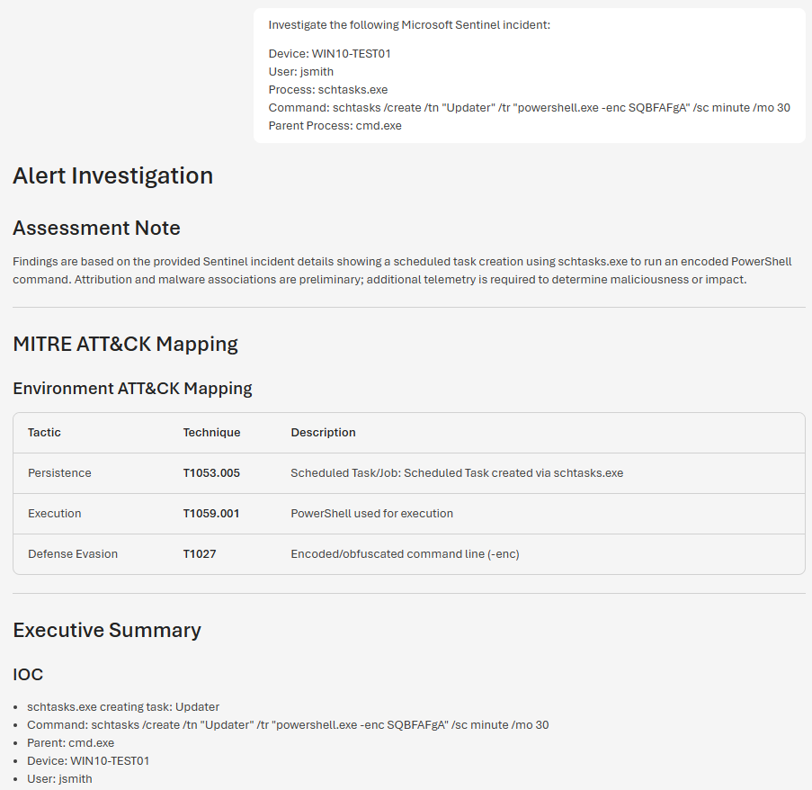
```

This works because the file exists in the `img` folder with the same name:

```text
SEN-003-Scheduled-Task-Creation.png
```

### Non-Technical Explanation

The image name in the README must match the image file name in the folder.

If one letter, dash, space, or symbol is different, GitHub may not show the image.

---

## Screenshots

The following screenshots demonstrate the AI Threat Hunt Agent performing cybersecurity investigation, threat hunting, and detection engineering tasks within Microsoft Foundry.

Each figure highlights a specific validation scenario used to test the agent's ability to produce structured, evidence-based investigation results.

---

### Figure 1: Threat Hunt Agent Architecture


**Overview:** The architecture diagram illustrates how Microsoft Foundry, security telemetry, threat intelligence, and the knowledge base work together to support AI-assisted threat hunting, investigations, detection reviews, and SOC reporting.

### Non-Technical Explanation

This diagram shows how the agent receives security information, uses its knowledge base, and helps produce investigation results.

---

### Figure 2: Malicious Domain Validation

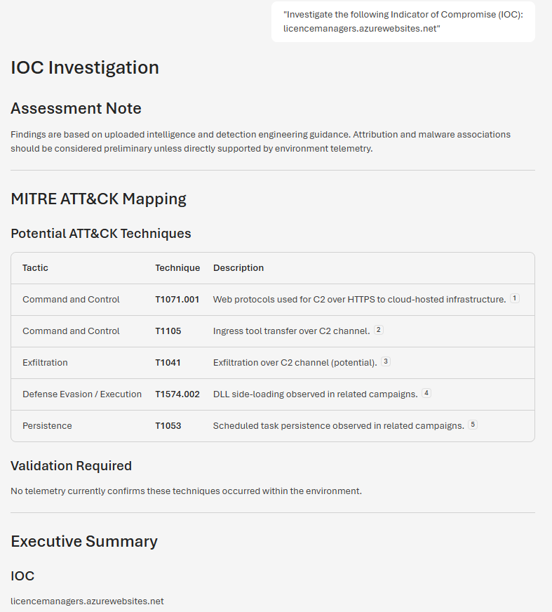

**Overview:** The agent investigates a suspicious domain, assesses potential risk, provides IOC classification, and recommends investigation and hunting activities.

### Non-Technical Explanation

This shows the agent reviewing a suspicious website or domain and helping decide whether it may be risky.

---

### Figure 3: SHA256 Hash Analysis

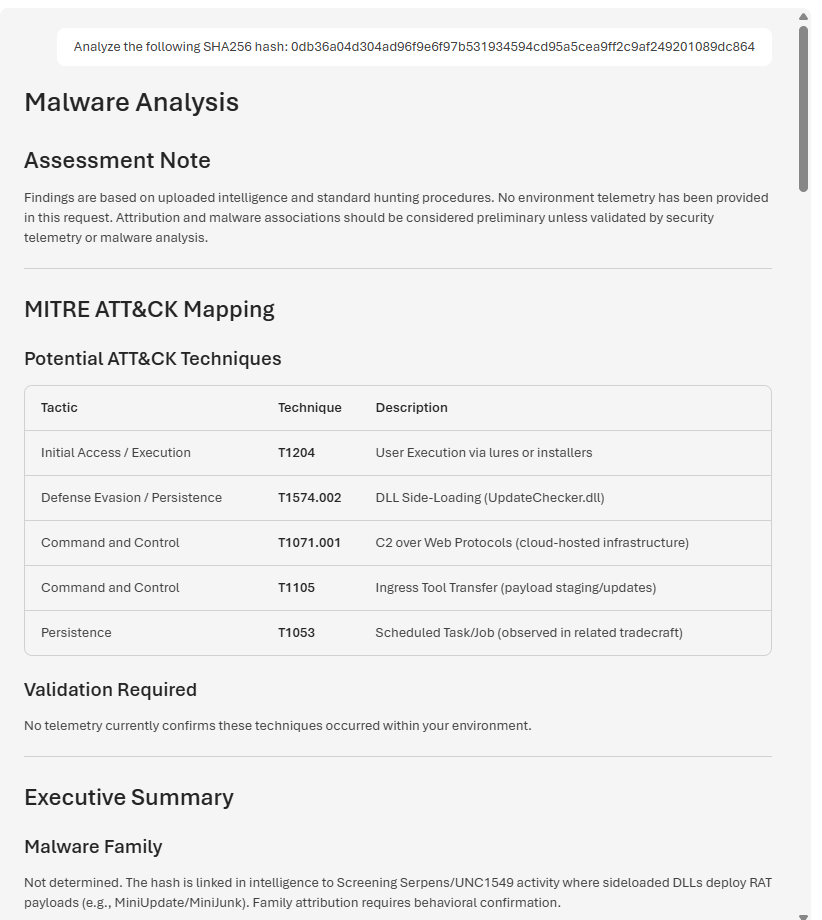

**Overview:** The agent analyzes a SHA256 file hash, reviews available reputation information, and provides evidence-based investigation recommendations.

### Non-Technical Explanation

This shows the agent reviewing a file fingerprint to help determine whether the file may be suspicious or malicious.

---

### Figure 4: Unknown Domain Validation

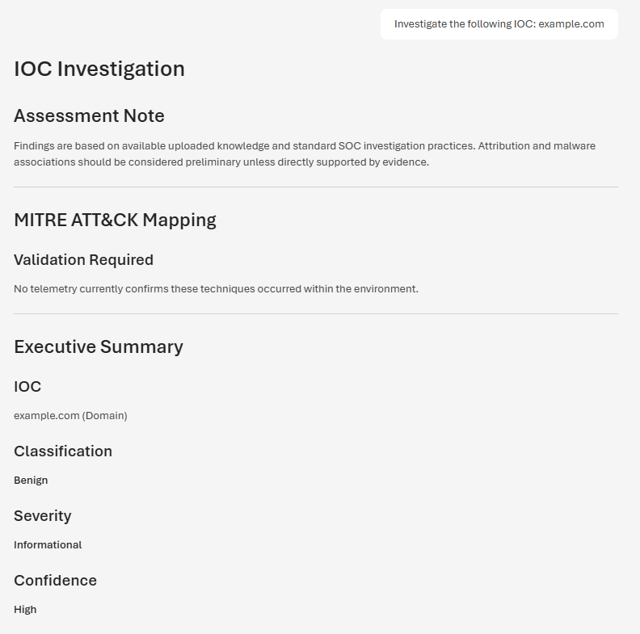

**Overview:** The agent evaluates a domain with limited intelligence and demonstrates how uncertainty is handled without making unsupported conclusions.

### Non-Technical Explanation

This shows the agent explaining that there is not enough evidence to label something as malicious.

---

### Figure 5: Benign Domain Validation

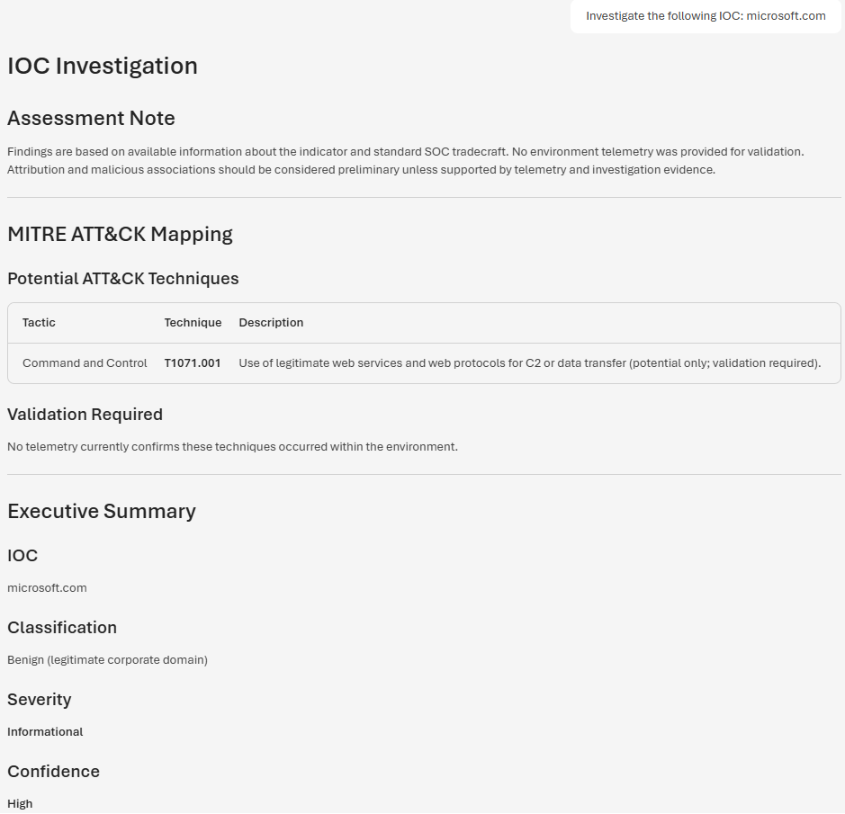

**Overview:** The agent reviews a known legitimate domain and correctly identifies it as benign while maintaining an evidence-based assessment process.

### Non-Technical Explanation

This shows the agent recognizing a trusted domain while still explaining how to validate the activity.

---

### Figure 6: Malicious Hash Validation

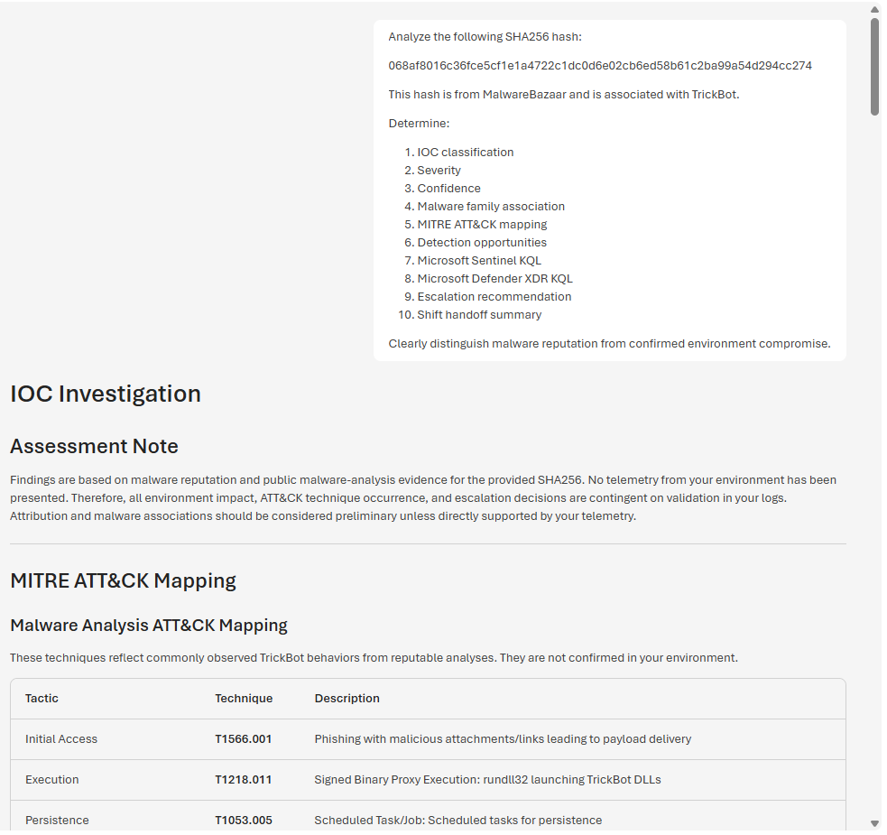

**Overview:** The agent analyzes a known malicious file hash, correlates available intelligence, and separates malware reputation from confirmed compromise activity.

### Non-Technical Explanation

This shows the agent reviewing a known bad file fingerprint while clearly explaining that reputation alone does not prove an internal system was compromised.

---

### Figure 7: DNS Beaconing Investigation

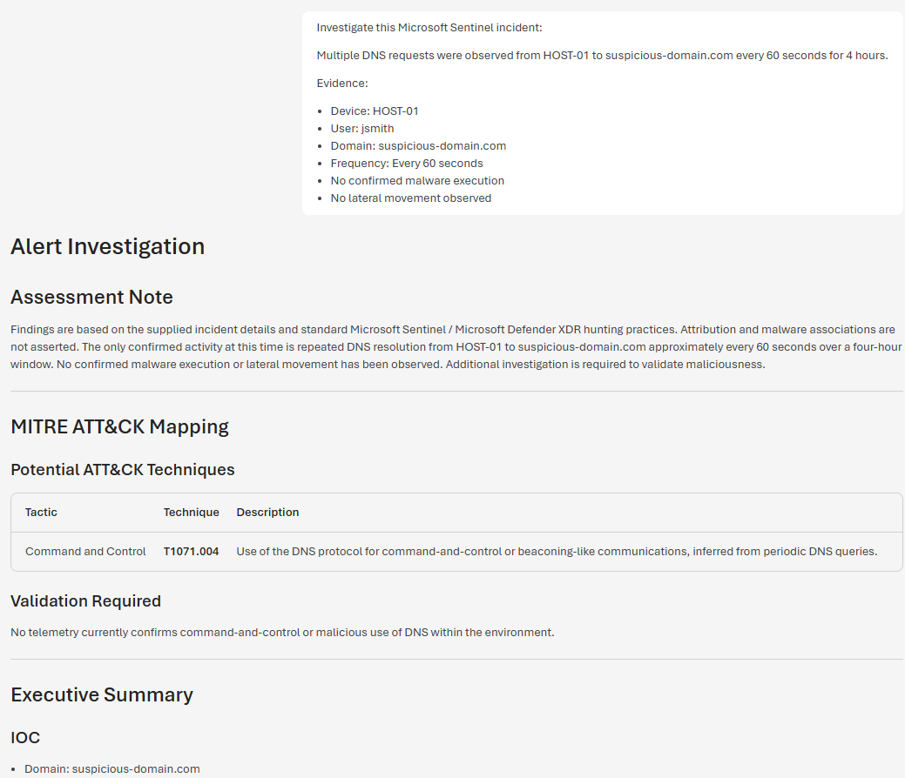

**Overview:** The agent investigates repeated DNS communication patterns that may indicate command-and-control activity and recommends additional validation steps.

### Non-Technical Explanation

This shows the agent reviewing repeated network activity that could be a sign of a system trying to communicate with an attacker-controlled server.

---

### Figure 8: PowerShell Execution Investigation

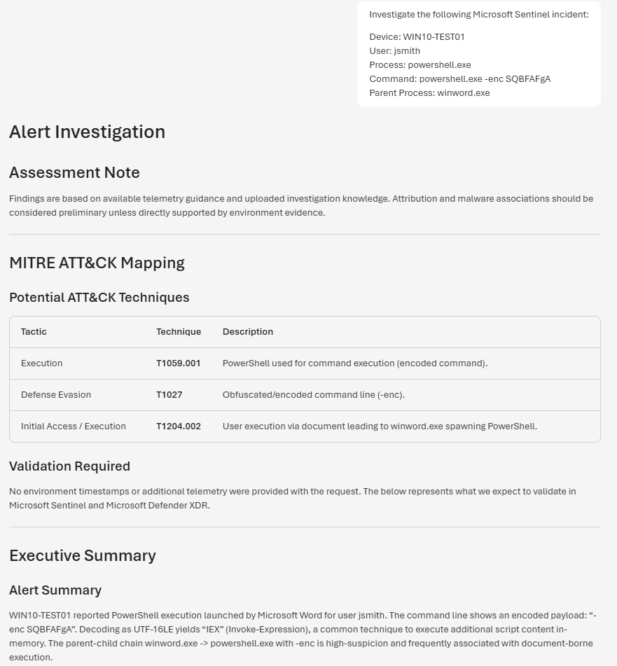

**Overview:** The agent reviews suspicious PowerShell execution activity, maps findings to MITRE ATT&CK techniques, and generates investigation guidance.

### Non-Technical Explanation

This shows the agent reviewing suspicious command activity and explaining why it may need further investigation.

---

### Figure 9: Scheduled Task Creation Investigation


**Overview:** The agent reviews a scheduled task creation scenario that may indicate persistence and recommends additional validation steps.

### Non-Technical Explanation

This shows the agent checking whether a scheduled task may have been created to keep suspicious activity running over time.

---

### Figure 10: MITRE ATT&CK Threat Hunt

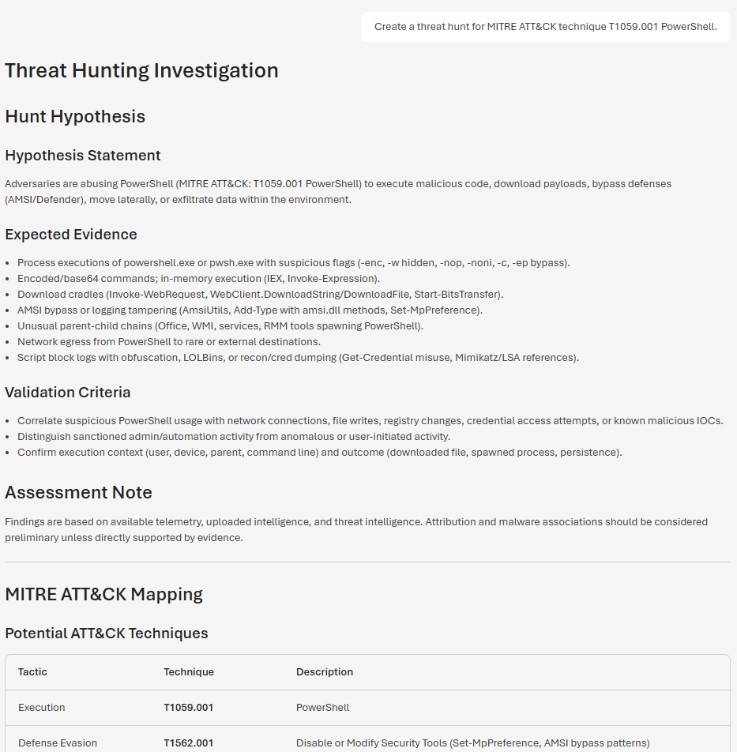

**Overview:** The agent creates a threat hunt based on MITRE ATT&CK technique T1059.001 PowerShell and provides hunting logic for analyst review.

### Non-Technical Explanation

This shows the agent helping analysts search for suspicious PowerShell behavior before a confirmed incident is declared.

---

### Figure 11: IOC-Driven Threat Hunt

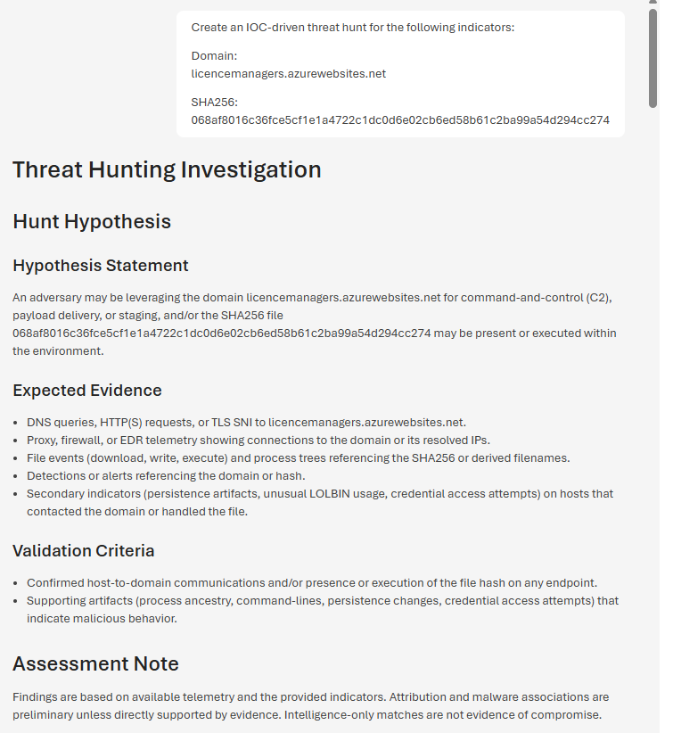

**Overview:** The agent creates a threat hunt using a suspicious domain and file hash to help analysts search for related activity.

### Non-Technical Explanation

This shows the agent using known indicators, such as a domain and file fingerprint, to help analysts look for matching activity.

---

### Figure 12: Detection Engineering Review

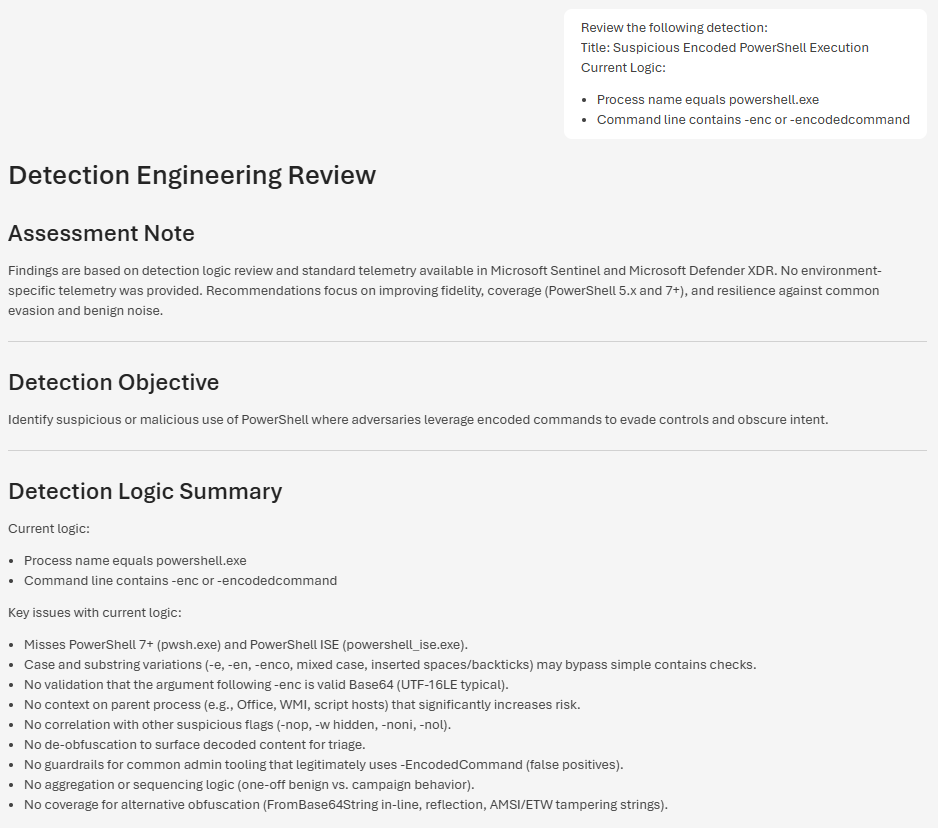

**Overview:** The agent evaluates an existing detection rule, identifies potential coverage gaps, and recommends improvements to increase detection effectiveness.

### Non-Technical Explanation

This shows the agent helping improve a security alert rule so it can better detect suspicious activity.

---

### Figure 13: False Positive Review

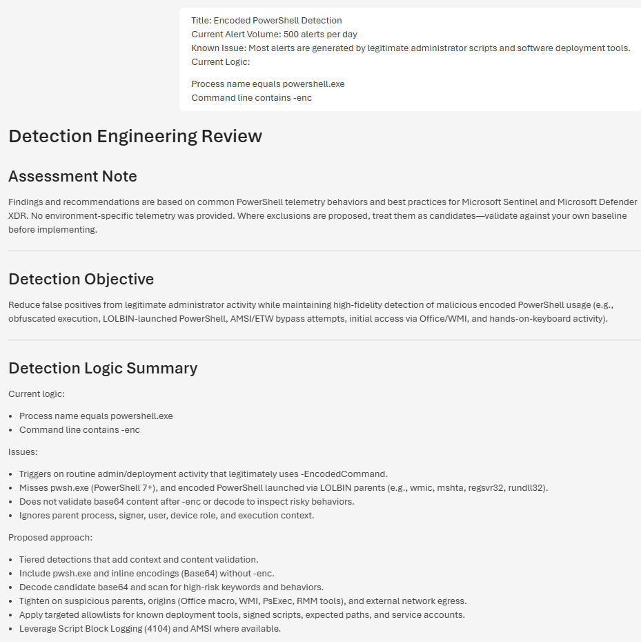

**Overview:** The agent analyzes noisy detection logic and recommends tuning strategies to reduce false positives while preserving security coverage.

### Non-Technical Explanation

This shows the agent helping reduce unnecessary alerts while keeping important security coverage in place.

---

## Screenshot Summary

The screenshots demonstrate the agent's ability to:

- Investigate Indicators of Compromise
- Analyze file hashes and domains
- Support Microsoft Sentinel investigations
- Review scheduled task persistence scenarios
- Perform MITRE ATT&CK-aligned threat hunting
- Perform IOC-driven threat hunting
- Review detection logic
- Reduce false positives
- Generate investigation recommendations
- Produce SOC-ready security reporting

### Non-Technical Explanation

Together, the screenshots show that the agent was tested across different security scenarios and can produce clear investigation outputs.

---

## Key Features

### Evidence-Based Investigations

The agent prioritizes:

1. Telemetry
2. Investigation evidence
3. Uploaded knowledge
4. Threat intelligence

This means the agent reviews facts before making conclusions.

### MITRE ATT&CK Integration

The agent maps findings to:

- Tactics
- Techniques
- Procedures

The agent also clearly separates:

- Confirmed activity
- Intelligence matches
- Assumptions
- Observations

### KQL Generation

The agent generates:

- Microsoft Sentinel queries
- Microsoft Defender XDR queries
- IOC hunts
- Threat hunting queries

### SOC Reporting

The agent produces:

- Executive summaries
- Investigation reports
- Escalation recommendations
- Shift handoff summaries

### Non-Technical Explanation

These features help analysts review security events, search for related activity, and document findings in a clear format.

---

## Security Considerations

This solution follows several core principles:

- Evidence over assumptions
- Validation over speculation
- Telemetry over intelligence
- Correlation over isolated indicators
- Human analyst review before action
- Reproducible findings

The agent does not automatically declare incidents or compromise without supporting evidence.

### Non-Technical Explanation

The agent is designed to be careful.

It should not claim something is a confirmed incident unless there is enough evidence to support that conclusion.

---

## Lessons Learned

Key observations from this project:

- AI can improve investigation consistency.
- Strong instructions significantly improve response quality.
- Threat intelligence should support investigations, not replace telemetry.
- Validation testing is critical before operational use.
- KQL should be reviewed before production use.
- Human analyst review remains essential.

### Key Lesson

AI is most effective when it works with analysts, not instead of analysts.

### Non-Technical Explanation

AI can help organize and speed up the investigation process, but a human analyst should still review the evidence and make the final decision.

---

## Business Value

This project demonstrates how AI can enhance cybersecurity operations by helping analysts work more efficiently and consistently.

### Operational Benefits

- Reduces manual investigation effort
- Accelerates alert triage and analysis
- Improves investigation consistency across analyst shifts
- Standardizes reporting and documentation
- Supports junior analysts with structured guidance
- Reduces time spent creating hunting queries

### Security Benefits

- Encourages evidence-based investigations
- Improves IOC validation workflows
- Supports MITRE ATT&CK-aligned threat hunting
- Assists with detection engineering reviews
- Helps identify opportunities to reduce false positives
- Improves visibility into suspicious activity

### Organizational Benefits

- Improves SOC efficiency
- Reduces analyst workload
- Supports knowledge sharing across teams
- Enhances investigation quality
- Improves reporting for leadership and stakeholders
- Demonstrates practical use of AI in cybersecurity operations

### Key Takeaway

The AI Threat Hunt Agent shows how AI can assist security teams by organizing information, accelerating investigations, and producing consistent security outputs while keeping analysts in control of operational decisions.

### Non-Technical Explanation

The business value is simple: the agent helps security teams save time, improve consistency, and document investigations more clearly.

---

## Future Enhancements

Potential improvements include:

- Live Microsoft Sentinel integration
- Live Microsoft Defender XDR integration
- Automated incident enrichment
- Threat intelligence automation
- Automated KQL deployment
- Detection content generation
- SOC analyst workflow automation
- Additional identity and cloud security test scenarios

### Non-Technical Explanation

Future versions could connect more directly to live security tools and automate more parts of the investigation workflow.

---

## References

- Microsoft Foundry Documentation: https://learn.microsoft.com/azure/ai-foundry/
- Microsoft Foundry Agents Documentation: https://learn.microsoft.com/azure/ai-foundry/agents/
- Microsoft Sentinel Documentation: https://learn.microsoft.com/azure/sentinel/
- Microsoft Defender XDR Documentation: https://learn.microsoft.com/defender-xdr/
- Microsoft Defender Advanced Hunting Documentation: https://learn.microsoft.com/defender-xdr/advanced-hunting-overview
- Kusto Query Language Documentation: https://learn.microsoft.com/kusto/query/
- MITRE ATT&CK Framework: https://attack.mitre.org/
- MalwareBazaar: https://bazaar.abuse.ch/
- GitHub Docs: https://docs.github.com/
- Git Documentation: https://git-scm.com/doc
- Visual Studio Code Documentation: https://code.visualstudio.com/docs
- Windows Subsystem for Linux Documentation: https://learn.microsoft.com/windows/wsl/

---

## Author

James Banday  

GitHub: https://github.com/jbanday808  

LinkedIn: https://www.linkedin.com/in/james-allen-morta-banday-62a391128/

---

## Disclaimer

This project is intended for educational, research, demonstration, and portfolio purposes.

All investigation findings generated by the AI agent should be validated using actual Microsoft Sentinel, Microsoft Defender XDR, endpoint, identity, network, and threat intelligence telemetry before making operational security decisions.

### Non-Technical Explanation

This project is a portfolio and learning project. Any real security decision should still be reviewed by a qualified analyst using real evidence from the environment.
