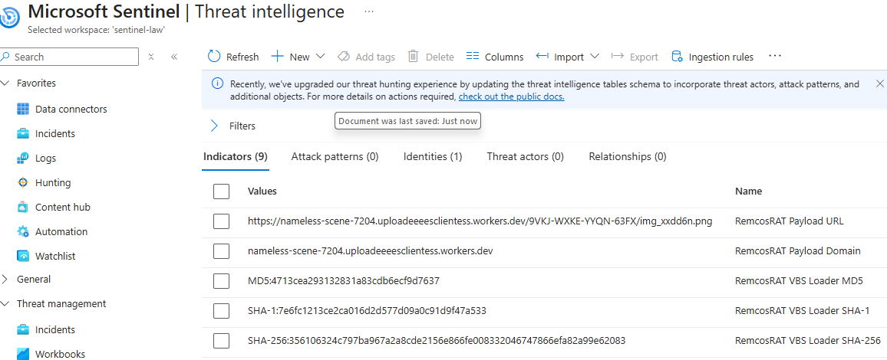

# RemcosRAT Microsoft Sentinel Integration

This folder contains threat-intelligence files, behavioral artifacts, and Kusto Query Language (KQL) queries created from an authorized static analysis of an obfuscated RemcosRAT Visual Basic Script (VBS) and PowerShell loader. The files are designed to help analysts investigate possible RemcosRAT-related activity in Microsoft Sentinel.

The malware sample is not stored in this repository. This project is intended for authorized defensive security research and does not claim that the loader ran in a monitored environment or that any system was compromised.

---

## Non-Technical Explanation

This folder is like an investigation kit for security teams. It contains a list of known warning signs, a list of suspicious behaviors, and prepared searches that help analysts look through Microsoft Sentinel security records.

The warning signs include items such as file fingerprints and suspicious internet addresses. The behavioral artifacts describe actions that may be associated with the malware, such as a script starting hidden PowerShell or downloading additional content.

Finding one warning sign is similar to finding a clue during an investigation. It tells the analyst where to look more closely, but it does not automatically prove that a computer was infected.

Microsoft Sentinel helps collect and search security records. The files in this folder make those searches consistent and repeatable, while a human analyst reviews the surrounding evidence and decides what the activity means.

---

## What This Project Helps Analysts Do

- Store known RemcosRAT warning signs in Microsoft Sentinel
- Search for suspicious files, network destinations, and processes
- Compare activity against documented behavioral patterns
- Validate that threat-intelligence records were imported correctly
- Organize investigation evidence
- Support consistent human analyst review

This project supports analyst judgment; it does not replace it.

---

## Folder Structure

```text
sentinel/remcosrat/
├── README.md
├── kql/
│   ├── remcosrat-hash-hunt.kql
│   ├── remcosrat-network-hunt.kql
│   ├── remcosrat-process-hunt.kql
│   └── remcosrat-threat-intel-validation.kql
├── threat-intelligence/
│   ├── remcosrat-iocs.csv
│   ├── remcosrat-sentinel-import.json
│   └── remcosrat-stix-bundle.json
└── watchlists/
    └── remcosrat-behavioral-artifacts.csv
```

| Folder | Purpose |
|---|---|
| [`kql/`](kql/) | Prepared searches for indicator validation and threat hunting. |
| [`threat-intelligence/`](threat-intelligence/) | Known warning signs in reviewable and structured formats. |
| [`watchlists/`](watchlists/) | Behavior-oriented reference data for investigation and correlation. |

---

## Included Files

| File | Purpose |
|---|---|
| [`remcosrat-iocs.csv`](threat-intelligence/remcosrat-iocs.csv) | Human-readable catalog of indicators and selected analysis artifacts. |
| [`remcosrat-sentinel-import.json`](threat-intelligence/remcosrat-sentinel-import.json) | JavaScript Object Notation (JSON) records prepared for the tested Sentinel import workflow. |
| [`remcosrat-stix-bundle.json`](threat-intelligence/remcosrat-stix-bundle.json) | Structured Threat Information Expression (STIX) 2.1 bundle for exchanging five standard indicators. |
| [`remcosrat-behavioral-artifacts.csv`](watchlists/remcosrat-behavioral-artifacts.csv) | Comma-separated values (CSV) catalog of 19 behavior-oriented clues for a Sentinel watchlist. |
| [`remcosrat-hash-hunt.kql`](kql/remcosrat-hash-hunt.kql) | Searches file-event records for exact loader hashes. |
| [`remcosrat-network-hunt.kql`](kql/remcosrat-network-hunt.kql) | Searches network-event records for documented network clues. |
| [`remcosrat-process-hunt.kql`](kql/remcosrat-process-hunt.kql) | Searches process-event records for related commands and behaviors. |
| [`remcosrat-threat-intel-validation.kql`](kql/remcosrat-threat-intel-validation.kql) | Checks whether expected indicators are present and usable in Sentinel. |

The IOC catalog is a convenient review source, but not every row is a standard threat-intelligence object. The JSON import files contain the selected hashes, domain, and URL; filenames, paths, commands, and similar clues remain behavioral content.

---

## How Microsoft Sentinel Uses These Files

Microsoft Sentinel is a cloud security platform that brings security data together for searching and investigation. In this project, Sentinel can store the structured threat-intelligence records, hold the behavioral CSV as reference data, and run the KQL searches against available security logs.

The threat-intelligence JSON files add known indicators to Sentinel's intelligence store through an approved import process. Importing a record means Sentinel can manage and search that warning sign; it does not mean the value was seen on a device.

The behavioral CSV can be uploaded as a watchlist. A watchlist is a reference table that a query can compare with security events; it does not collect device activity or generate proof by itself.

The KQL files search Microsoft Defender XDR event tables made available to Sentinel. Microsoft Defender XDR (Extended Detection and Response) records device file, network, and process activity when the required data connectors, permissions, fields, and retention are available.

---

## Threat Intelligence and Behavioral Artifacts

Threat intelligence is a list of specific warning signs already associated with the analyzed loader. These are often called indicators of compromise (IOCs), although a match still needs validation before it can support a compromise conclusion.

Behavioral artifacts describe actions, commands, names, or tools associated with the loader's intended behavior. Examples include a script interpreter starting a VBS file, Windows Management Instrumentation (WMI) launching PowerShell, or PowerShell using download and decoding functions.

| Content type | Examples here | What a match means |
|---|---|---|
| Threat-intelligence record | SHA-256, SHA-1, and MD5 file hashes; a domain; a URL | A security record resembles a specific known warning sign and needs verification. |
| Behavioral artifact | Filenames, paths, script objects, commands, methods, and decoding strings | An event resembles documented behavior, which could also have a legitimate explanation. |

Exact intelligence is generally more specific than a behavior such as PowerShell use. Neither type automatically establishes execution, infection, or compromise.

---

## Evidence Boundaries

The project keeps several kinds of evidence separate so that an investigation does not overstate its findings.

| Evidence type | What it establishes | What it does not establish |
|---|---|---|
| Static-analysis finding | A string, capability, or intended action was recovered without running the sample. | That the action occurred in any monitored environment. |
| Threat-intelligence record | A known warning sign was documented or imported for searching. | That the warning sign appeared in collected security data. |
| Behavioral artifact | A pattern can be used to look for similar activity. | That a matching event is malicious or unique to RemcosRAT. |
| Security telemetry | A file, network, or process event exists in collected logs. | That the event confirms malware without adequate context and correlation. |
| Analyst-validated incident | A qualified analyst reviewed correlated evidence and applied the organization's incident criteria. | A conclusion that can be reached from a lone import record or query match. |

Security telemetry means records produced by systems, applications, network controls, and security tools. It becomes useful evidence only when the relevant data was collected correctly and interpreted in context.

---

## KQL Query Guide

Kusto Query Language is the search language used by Microsoft Sentinel. The hunting queries use a 30-day lookback where specified; analysts should adapt the period to the investigation scope and available retention.

| Query | Searches | Designed to find | Result boundary |
|---|---|---|---|
| [`remcosrat-hash-hunt.kql`](kql/remcosrat-hash-hunt.kql) | `DeviceFileEvents` | Exact SHA-256, SHA-1, or MD5 matches in file and initiating-process hash fields. | A hash match is a strong lead, not proof that the file executed. |
| [`remcosrat-network-hunt.kql`](kql/remcosrat-network-hunt.kql) | `DeviceNetworkEvents` | The documented full URL, domain, or downloaded filename in network and process context. | A returned event needs destination, process, device, and timing review. |
| [`remcosrat-process-hunt.kql`](kql/remcosrat-process-hunt.kql) | `DeviceProcessEvents` | The VBS name and path, script hosts, WMI-launched PowerShell, hidden-start clues, download and decoding functions, and related .NET strings. | The query labels behavioral similarity and assigns investigation priority; legitimate tools can overlap. |
| [`remcosrat-threat-intel-validation.kql`](kql/remcosrat-threat-intel-validation.kql) | `ThreatIntelIndicators` | Whether all five expected indicators are present, missing, inactive, deleted, revoked, not yet valid, or expired. | It validates intelligence storage and lifecycle state, not device activity. |

An empty query result means no matching record was returned within that query's data and time scope. It does not prove the absence of related activity when logs are unavailable, delayed, filtered, or outside retention.

---

## Microsoft Sentinel Import Validation



The [Sentinel validation screenshot](../../images/remcosrat/RemcosRAT_Sentinel_15_Threat_Intelligence_Import_Validation_35610632.png) shows the Threat intelligence interface with five expected RemcosRAT records visible after import: three file hashes, one domain, and one URL.

### What the Screenshot Proves

- The five displayed indicator values were visible in the Sentinel threat-intelligence interface when the image was captured.
- Hash, domain, and URL indicator types are represented.
- The displayed records retained analyst-friendly RemcosRAT names.
- The tested import workflow placed those records where Sentinel could list them as threat intelligence.

### What the Screenshot Does Not Prove

- That the loader or malware executed in the monitored environment
- That an endpoint was infected or an organization was compromised
- That any displayed indicator was observed in security telemetry
- That a device contacted the domain or URL, or created a matching file
- That Sentinel generated an alert or an analyst-validated incident
- That every required data source was connected, complete, or retained
- That the indicators remain active or present after the capture date

The screenshot documents threat-intelligence import, not detection of activity. Analysts should use the validation query to check current record state and the hunting queries to examine actual security logs.

---

## Recommended Analyst Workflow

1. Review the authorized static-analysis source and its evidence limitations.
2. Validate the CSV or JSON structure before use in an approved workspace.
3. Import the threat-intelligence records through the organization's approved process.
4. Run the validation query and review missing, inactive, deleted, revoked, or expired records.
5. Upload the behavioral CSV as a watchlist only under the approved workspace procedure.
6. Run the file, network, and process hunts against the correct data sources and time range.
7. Correlate results across device, process, network, identity, alert, and business context.
8. Record confirmed observations, assumptions, uncertainties, and data gaps separately.
9. Escalate or contain activity only under approved procedures and analyst-reviewed evidence.

---

## Why Human Analyst Review Is Required

Queries compare text and values in the data they can access. They cannot independently determine whether an administrator used a legitimate script, whether a reused internet service is benign in context, or whether missing logs hide important events.

A human analyst checks data quality, device and user context, timing, process relationships, and supporting alerts. The analyst also decides whether separate observations form a credible activity chain and meet the organization's incident criteria.

No conclusion of RemcosRAT execution, infection, or compromise should be made from these files, the screenshot, or a single KQL result alone.

---

## Additional Documentation

Detailed technical analysis is intentionally not repeated here. See:

- [RemcosRAT VBS loader knowledge document](../../agent-knowledge/malware/remcosrat-vbs-loader.md)
- [RemcosRAT Sentinel integration guide](../../src/remcosrat/remcosrat-sentinel-integration.md)

These documents provide the full analysis context, implementation details, and defensive investigation guidance.
